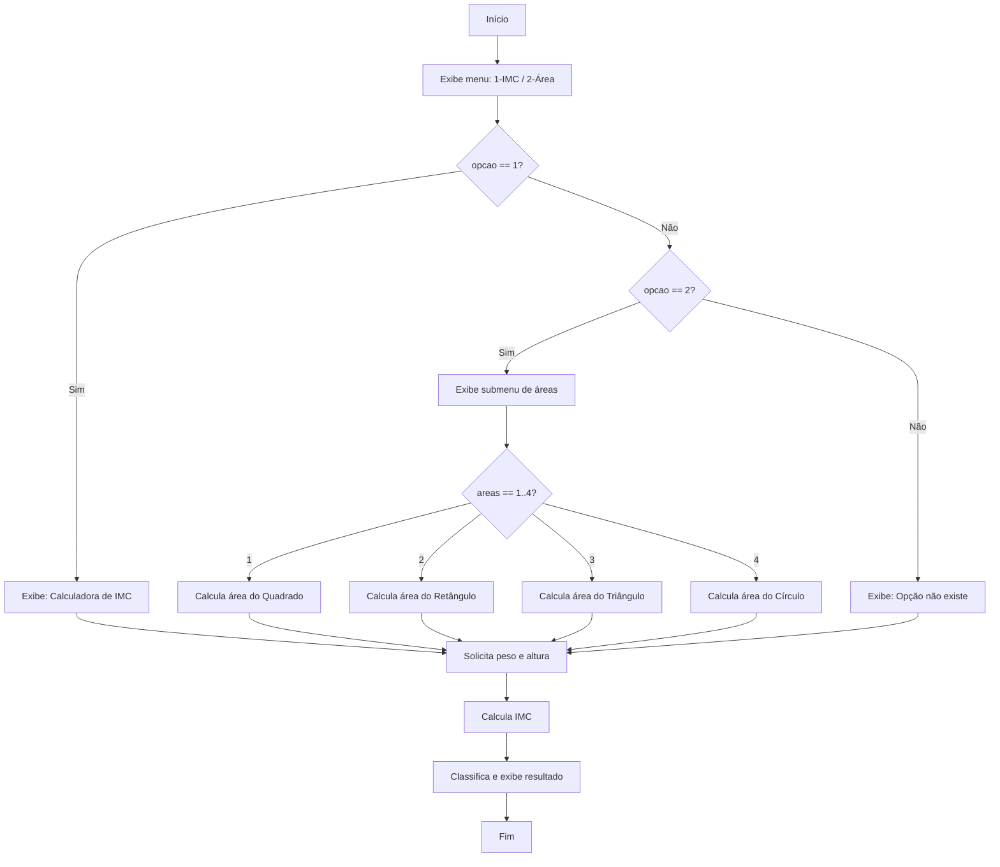

# 🧮 Calculadora de IMC e Área — Flowgorithm


> Fluxograma desenvolvido no **Flowgorithm** que implementa um menu de calculadoras: **Índice de Massa Corporal (IMC)** e **Área de figuras geométricas** (Quadrado, Retângulo, Triângulo e Círculo).

**Autor:** João Vitor Lino Teixeira
**Arquivo:** `calculadora.fprg` (sugestão: `flowalgoritmo-calculadoras.fprg`)

---

## 📑 Sumário

- [Sobre o Projeto](#-sobre-o-projeto)
- [Funcionalidades](#-funcionalidades)
- [Fórmulas Utilizadas](#-fórmulas-utilizadas)
- [Fluxo do Programa](#-fluxo-do-programa)
- [Como Executar](#️-como-executar)
- [Observação Importante](#-observação-importante)
- [Conceitos Aplicados](#-conceitos-aplicados)

---

## 📌 Sobre o Projeto

Este algoritmo foi construído como exercício prático da disciplina **Algoritmos e Pensamento Computacional**, usando o **Flowgorithm** — uma ferramenta de fluxogramas que permite representar visualmente a lógica de programação antes (ou em vez) de escrevê-la em uma linguagem como C.

O programa apresenta um **menu inicial** onde o usuário escolhe entre duas calculadoras:

1. Calculadora de **IMC**
2. Calculadora de **Área** (com 4 sub-opções de figuras geométricas)

---

## ⚙️ Funcionalidades

### 1️⃣ Menu Principal
```
Escreva a opção desejada:
1 - Calculadora de IMC
2 - Calculadora de área
```

### 2️⃣ Calculadora de Área (opção 2)
Submenu com 4 figuras geométricas:

| Opção | Figura     | Dados solicitados      |
|-------|------------|-------------------------|
| 1     | Quadrado   | Lado                    |
| 2     | Retângulo  | Base e Altura           |
| 3     | Triângulo  | Base e Altura           |
| 4     | Círculo    | Raio                    |

### 3️⃣ Calculadora de IMC
Solicita **peso (kg)** e **altura (m)** e classifica o resultado.

---

## 🧮 Fórmulas Utilizadas

| Cálculo               | Fórmula                          |
|------------------------|-----------------------------------|
| Área do Quadrado       | `lado * lado`                    |
| Área do Retângulo      | `base * altura`                  |
| Área do Triângulo      | `(base * altura) / 2`            |
| Área do Círculo        | `3.14 * (raio * raio)`           |
| IMC                     | `peso / (altura * altura)`       |

### Classificação do IMC

| Faixa               | Classificação   |
|----------------------|------------------|
| IMC < 18.5           | Abaixo do peso   |
| 18.5 ≤ IMC < 25.0    | Peso ideal       |
| 25.0 ≤ IMC < 30.0    | Sobrepeso        |
| IMC ≥ 30.0           | Obesidade        |

---

## 🔀 Fluxo do Programa



---

## ▶️ Como Executar

1. Baixe e instale o **[Flowgorithm](http://www.flowgorithm.org/download/index.htm)**;
2. Coloque o arquivo `calculadora.fprg` (ou `flowalgoritmo-calculadoras.fprg`) dentro da pasta:

```
desenvolvimento-de-algoritmo-e-pensamento-computacional/calculadora-flowgorithm/
```

3. Abra o arquivo no Flowgorithm;
4. Clique em **Execute** (ou `F5`) para rodar o fluxograma;
5. É possível gerar código em C pelo menu `Code Generators` do Flowgorithm.

---

## ⚠️ Observação Importante

No fluxo atual, o bloco de **cálculo de IMC** está posicionado **fora** da estrutura `if/else` do menu principal — ou seja, ele é executado **independentemente da opção escolhida** (1, 2 ou inválida), logo após o bloco do menu terminar.

Para que o programa se comporte como uma calculadora com opções mutuamente exclusivas (calcular *apenas* IMC **ou** *apenas* área), sugere-se mover o bloco de IMC para dentro do `then` da condição `opcao == 1`, e adicionar um `return`/fim de execução após cada ramo, evitando a execução em sequência de ambas as calculadoras.

---

## 🧠 Conceitos Aplicados

- Estruturas condicionais aninhadas (`if / else if / else`);
- Entrada e saída de dados (`input` / `output`);
- Declaração e atribuição de variáveis (`Integer`, `Real`);
- Operadores aritméticos e relacionais;
- Lógica de menus e submenus;
- Boas práticas de fluxo de controle (ponto de atenção citado acima).

---

## 👤 Autor

**João Vitor Lino Teixeira**
Disciplina: Algoritmos e Pensamento Computacional — Prof.ª Karla
UDF - Centro Universitário do Distrito Federal
